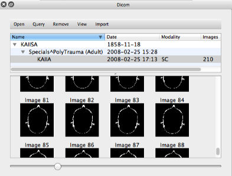

Dicom plugin {#org_custusx_dicom}
===================

Overview {#org_custusx_dicom_overview}
========================

The DICOM plugin enables import of DICOM volumes. 

The plugin is based on the [CTK library](http://www.commontk.org/index.php/Documentation/Dicom_Overview) and [DCMTK](http://dicom.offis.de/).

Series can be imported into CustusX as volumes. The DICOM standard is large, and by no means all parts are implemented. We try to cover as large a part of the standard as possible.

\addindex dicom_widget

DICOM Widget {#org_custusx_dicom_widget}
-----------------------------------------------------------

The DICOM Widget provides DICOM import and some PACS integration. See \ref org_custusx_dicom for more.

