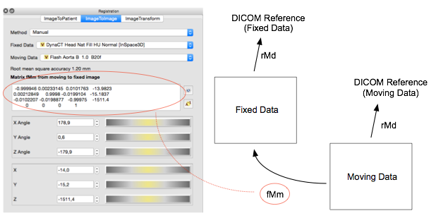

Manual Image to Image Registration Method {#org_custusx_registration_method_manual_image2image_top}
===================

\addindex org_custusx_registration_method_manual_image2image
Manual Image to Image Registration {#org_custusx_registration_method_manual_image2image}
===========================================================

Direct setting of image to image registration.

Manipulate the image2image registration matrix, fMm, via a matrix or xyz+angles input.
The matrix fMm describes the movement from moving- to fixed image. The starting point for the movement is the initial rMd matrices for both moving- and fixed image.
That is, the rMd matrices representing the spatial information from the original DICOM datasets imported in CustusX. If landmarks are defined, the total Root Mean Square - RMS accuracy calculated for the active landmarks will be indicated in the GUI.

The fMm matrix input is compatible with resulting fusion matrices from external tools like Siemens Syngo Image Fusion/3D Roadmap.

